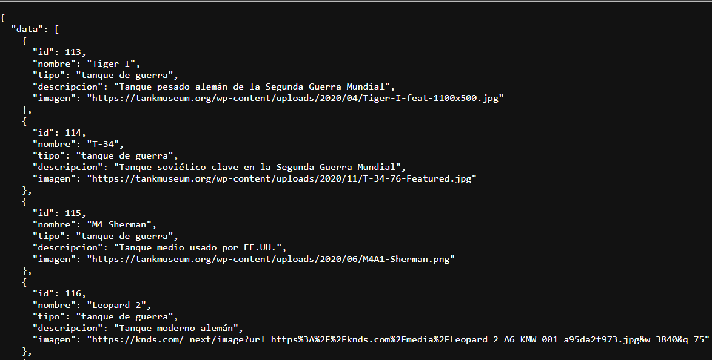

# Gestor de Tanques PWA-GRUPO-13-TP-EXPRESS

## Descripcion

Backend desarrollado con Node.js, Express y Prisma para administrar tanques de distintos tipos

---

## Integrantes del Grupo
* **Sastre Juan Ignacio** - FAI-4491
* **Gonzalez Marcos Nahuel** - FAI-4869
* **Bascur Sofia Natali** - FAI-4306

---

## Vercel
* **Link Frontend:** https://pwa-grupo-13-tp-2.vercel.app

* **Link Backend:** https://pwa-grupo-13-tp-express.vercel.app

* **Mostrar todos los Tanques:** https://pwa-grupo-13-tp-express.vercel.app/tanques


---

## Descripción de la Aplicación

El backend permite:

* **Visualización:** Permite obtener el listado de todos los tanques. GET /tanques
* **Por ID:** Permite filtrar un tanque según su ID. GET /tanques/:id
* **Crear:** Permite crear nuevos tanques. POST /tanques
* **Modificar:** Permite actualizar los datos de los tanques. PUT /tanques/:id
* **Eliminar:** Permite eliminar un tanque según su ID. DELETE /tanques/:id
* **Filtrado:** Permite filtrar la busqueda según su nombre o tipo.
* **Validacion y errores:** Se validan los datos ingresados y se implementa un manejo de errores HTTP.

---

## Tecnologias usadas

- Prisma ORM
- Express
- Node.js
- PostgreSQL

---

### 1. Clonar el repositorio
Abrir una terminal y ejecutar:
```bash
git clone https://github.com/nasusxd/PWA-GRUPO-13-TP-EXPRESS.git
cd PWA-GRUPO-13-TP-EXPRESS
```
---

### 2. Instalar las dependencias
```bash
npm install
```

### 3. Correr la aplicación
```bash
npm run dev
```

---

## Guia Backend

+ Ejecutar migraciones en desarrollo (crea/actualiza la BD):
```bash
npm run migrate:dev
```

+ Aplicar migraciones en un entorno ya configurado (deploy):
```bash
npm run migrate:deploy
```

+ Cargar el seed (crea 40 registros en la tabla `Tanque`):
```bash
npm run db:seed
```
El seed usa el script: [prisma/seed.js](prisma/seed.js)

+ Validar que la BD no esté vacía (sale con código 0 si hay datos):
```bash
npm run db:validat
```
El validador usa el script: [prisma/validateDb.js](prisma/validateDb.js)

## Estructura del Proyecto

```text
backend/
│
├── prisma/
│   ├── migrations/    
│   ├── schema.prisma 
│   ├── seed.js
│   └── validateDb.js      
│
├── src/
│   ├── lib/            
│   ├── middlewareas/        
│   ├── validations/       
│   ├── app.js          
│   ├── routes.js    
│   └── swagger.js
│
├── .env                    
├── .gitignore               
├── package-lock.json    
├── package.json 
├── README.md       
└── vercel.json               
```